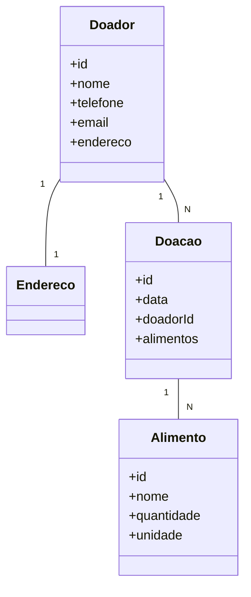

# Diagrama UML

```mermaid
classDiagram
  class Doador {
    +id
    +nome
    +telefone
    +email
    +endereco
  }

  class Endereco
  class Doacao {
    +id
    +data
    +doadorId
    +alimentos
  }

  class Alimento {
    +id
    +nome
    +quantidade
    +unidade
  }

  Doador "1" -- "1" Endereco
  Doador "1" -- "N" Doacao
  Doacao "1" -- "N" Alimento
```
